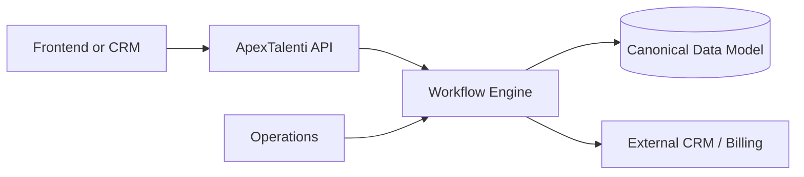
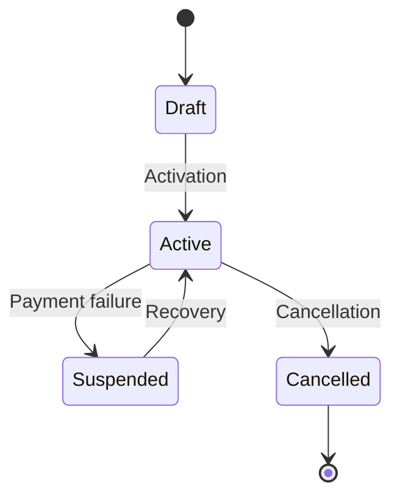

# Diagram playground

This page is used to test Mermaid diagrams inside ApexTalenti docs.

## Service interaction

```mermaid
flowchart LR
    UI[Frontend or CRM] --> API[ApexTalenti API]
    API --> WF[Workflow Engine]
    WF --> DB[(Canonical Data Model)]
    WF --> EXT[External CRM / Billing]
    OPS[Operations] --> WF
```

## Subscription lifecycle

```mermaid
stateDiagram-v2
    [*] --> Draft
    Draft --> Active: Activation
    Active --> Suspended: Payment failure
    Suspended --> Active: Recovery
    Active --> Cancelled: Cancellation
    Cancelled --> [*]
```
